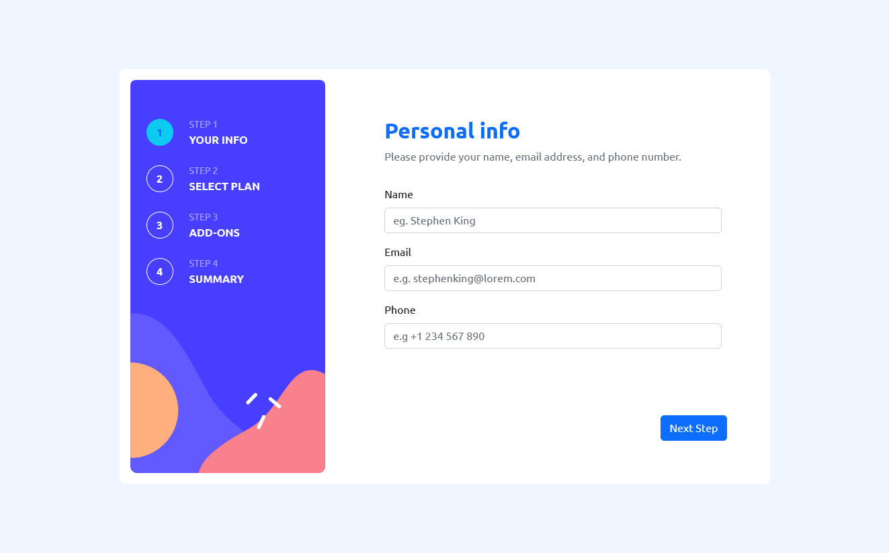

# Frontend Mentor - Multi-step form solution

This is a solution to the [Multi-step form challenge on Frontend Mentor](https://www.frontendmentor.io/challenges/multistep-form-YVAnSdqQBJ). Frontend Mentor challenges help you improve your coding skills by building realistic projects. 

## Table of contents

- [Frontend Mentor - Multi-step form solution](#frontend-mentor---multi-step-form-solution)
  - [Table of contents](#table-of-contents)
  - [Overview](#overview)
    - [The challenge](#the-challenge)
    - [Screenshot](#screenshot)
    - [Links](#links)
  - [My process](#my-process)
    - [Built with](#built-with)
    - [What I learned](#what-i-learned)
    - [Continued development](#continued-development)
  - [Author](#author)

**Note: Delete this note and update the table of contents based on what sections you keep.**

## Overview

### The challenge

Users should be able to:

- Complete each step of the sequence
- Go back to a previous step to update their selections
- See a summary of their selections on the final step and confirm their order
- View the optimal layout for the interface depending on their device's screen size
- See hover and focus states for all interactive elements on the page
- Receive form validation messages if:
  - A field has been missed
  - The email address is not formatted correctly
  - A step is submitted, but no selection has been made

### Screenshot




### Links

- Live Site URL: [Add live site URL here](https://multi-step-form.mathurinolivier.com)

## My process

### Built with

- Semantic HTML5 markup
- [React Bootstrap](https://react-bootstrap.github.io/)
- [React](https://reactjs.org/) - JS library
- [React-Hook-Form](https://react-hook-form.com/)
- [Zustand](https://github.com/pmndrs/zustand)
- Typescript


### What I learned

Theire is many way to solve this challenge.
- with router an a global store ( redux , context ...) 

But i like to try the FormContext.

First i use Zustand.

```html
<h1>Some HTML code I'm proud of</h1>
```
```css
.proud-of-this-css {
  color: papayawhip;
}
```
```js
const proudOfThisFunc = () => {
  console.log('🎉')
}
```


### Continued development

- Finished the mobile version.
- customize the color to match the design.

## Author

- Website - [OlivrM](https://www.mathurinolivier.com)
- Frontend Mentor - [@yourusername](https://www.frontendmentor.io/profile/yourusername)


